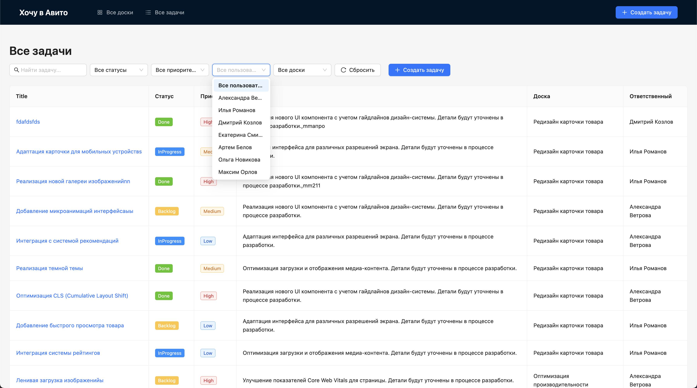

# Авито - Project Management Systems

## Структура проекта

Все файлы находятся в папке `/src`, структура внутри папки:

- `api` - http-клиент (axios), api-сервис, сервисы для запросов к серверу
- `components` - общие компоненты приложения
- `constants` - константы
- `hooks` - хуки, в основном запросы к серверу с помощью React Query
- `pages` - страницы
- `types` - глобальные типы
- `validations` - схемы для валидации

## Использованные технологии

- `antd` + `@ant-design/icons` - Готовые UI-компоненты. Для ускорения разработки (в ущерб весу, но ограничения по размеру бандла в ТЗ не было:)
- `@tanstack/react-query` - Кэширование, автоматические рефетчи, оптимизированные хуки. Управление состоянием API-запросов

- `react-hook-form` + `yup` - Удобное управление состоянием формы + удобная валидация форм через схему с помощью yup

- `@atlaskit/pragmatic-drag-and-drop` - замена react-beautiful-dnd от atlassian. Для dnd

## Как запустить

### Для локального запуска:

1. Перейти в папку frontend
2. Прописать `npm i`
3. Прописать `npm run dev`

### Для запуска в контейнере (frontend + backend + nginx)

1. Проверить, что запущен Docker
2. В корне проекта прописать `docker compose up --build `
3. Проект будет доступен по ссылке http://localhost:3000/

